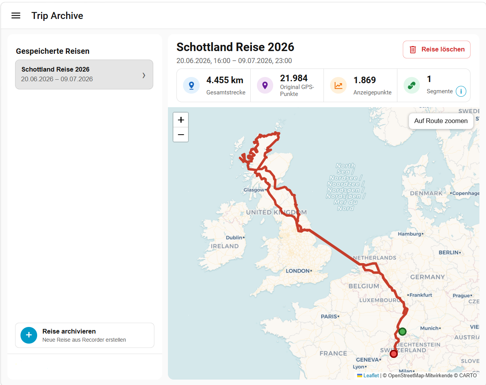

# Trip Archive

Archive completed journeys from **Home Assistant Recorder** and explore them later using an interactive map, travel statistics and permanently stored trip data.

> ⚠️ **Beta Software**
>
> Trip Archive is currently in **Beta (v0.3.0-beta.1)**.
> The complete Recorder-to-Archive workflow is implemented and stable, but the project is still evolving before its first stable release.

---

## Dashboard



Trip Archive permanently preserves completed journeys outside the Recorder database and provides an interactive map together with detailed travel statistics.

---

## Why Trip Archive?

Home Assistant Recorder is designed for short-term history. Depending on your Recorder settings, older location history is automatically removed over time.

Trip Archive solves this by creating permanent trip archives directly from Recorder data.

Unlike GPX import tools, Trip Archive does **not** rely on exported files or external services. Every archived journey is built directly from Home Assistant Recorder and stored locally.

The original archived GPS data always remains unchanged. Display routes, statistics and map visualizations are derived from this immutable data and can be recreated at any time.

---

## Features

### Archive

- Archive completed trips directly from Home Assistant Recorder
- Preserve immutable original GPS data
- Optional odometer support
- Permanent local trip storage

### Explore

- Interactive map view
- Travel statistics
- Simplified display routes for fast rendering
- Segment visualization
- Trip overview sidebar
- Responsive desktop and mobile layout

### Reliability

- Fully local operation
- No cloud services
- No external accounts
- No GPX imports
- No Garmin imports
- No OwnTracks imports
- Reproducible statistics and display routes

---

## Installation

### Manual Installation

1. Download the latest release from the GitHub Releases page.
2. Copy the **trip_archive** integration into your Home Assistant `custom_components` directory.
3. Restart Home Assistant.
4. Open:

```
Settings → Devices & Services
```

5. Click **Add Integration**.
6. Search for **Trip Archive**.

> **HACS support is planned for a future release.**

---

## Requirements

Trip Archive requires:

- Home Assistant
- Home Assistant Recorder
- Recorded location history
- At least one tracked location entity

Trips can only be archived after they have been recorded by Home Assistant Recorder.

---

## How It Works

```
Home Assistant Recorder
           │
           ▼
      Trip Archive
           │
           ├── Immutable archived GPS data
           ├── Display route generation
           ├── Travel statistics
           └── Interactive map
```

Trip Archive intentionally keeps its architecture simple.

Recorder is the **only source of trip data**.

The archived raw data never changes.

Everything shown in the dashboard—including statistics, display routes and map rendering—is generated from this immutable archive.

This guarantees that every trip can always be reproduced.

---

## Local Storage

Archived trips are stored locally inside Home Assistant.

```
/config/trip_archive/trips/
```

Each trip is stored independently and can be viewed or deleted without affecting Home Assistant Recorder.

---

## Reference Validation

Trip Archive has been validated using a real-world reference journey.

### Scotland 2026

| Item | Value |
|------|------:|
| Total distance | **4,455 km** |
| Original GPS points | **21,984** |
| Display points | **1,869** |
| Segments | **1** |
| Start odometer | **22,334 km** |
| End odometer | **26,789 km** |

This reference trip is used during development to verify route generation, statistics and data integrity.

---

## Project Status

Current release:

**v0.3.0-beta.1**

Current development focuses on:

- Stability
- Documentation
- Bug fixes
- Performance improvements
- Community feedback

---

## Documentation

Additional project documentation is included in this repository.

- CHANGELOG
- ROADMAP
- CONTRIBUTING
- RELEASE_CHECKLIST

Documentation will continue to grow during the beta phase.

---

## Roadmap

Planned improvements include:

- HACS support
- Additional statistics
- Improved performance
- More documentation
- Additional language translations

---

## Contributing

Bug reports, ideas and pull requests are always welcome.

If you discover an issue or have an idea for improvement, please open a GitHub Issue.

---

## License

This project is licensed under the **MIT License**.

---

Made with ❤️ for the Home Assistant community.
